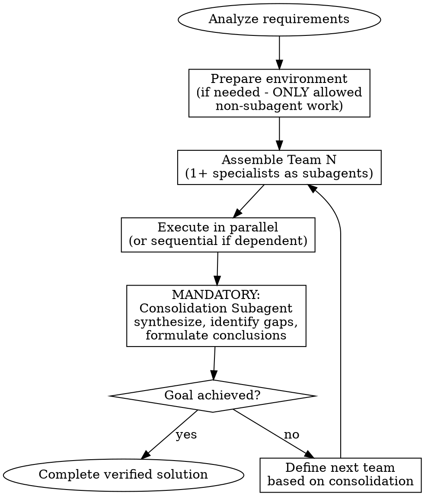

# Eliteteams - Iterative Specialist Teams

## Overview

Execute tasks through dynamically assembled specialist teams. Teams work sequentially; specialists within teams work in parallel. Every team's output is consolidated before the next team begins.

**Core principle:** No work happens outside subagents (except environment preparation like installing libraries, creating folders).

## When to Use

**TRIGGER:** User explicitly writes "eliteteams" in their request.

This is NOT automatic - only activate when explicitly requested.

## Technical Implementation (Claude Code)

**How to spawn specialists:** Use the `Task` tool with `subagent_type="general-purpose"`.

**Parallel execution:** Send multiple Task tool calls in a SINGLE message. Each specialist = one Task call with:
- `description`: "TeamN: Role name" (e.g., "Team1: Code analyst")
- `prompt`: Detailed instructions for this specialist
- `subagent_type`: "general-purpose"

**Sequential execution:** Wait for results, then send next Task call.

**Example - spawning 2 parallel specialists:**
```
Message with TWO Task tool calls:
1. Task(description="Team1: Code analyst", prompt="Analyze structure...", subagent_type="general-purpose")
2. Task(description="Team1: Doc analyst", prompt="Review documentation...", subagent_type="general-purpose")
```

**Consolidation subagent:** After receiving all specialist results, spawn ONE more Task that synthesizes them.

## The Iron Law

```
NO WORK OUTSIDE SUBAGENTS
```

**No exceptions:**
- Not for "quick checks"
- Not for "simple tasks"
- Not for "just reading a file"
- Even single-specialist teams must be subagents

**Only allowed outside subagents:** Repository/environment preparation (installing libraries, creating folders, git operations).

## Process Flow



## Team Assembly Rules

| Rule | Implementation |
|------|----------------|
| **Minimum team size** | 1 specialist (still must be subagent) |
| **Specialist selection** | Match expertise to specific task requirements |
| **Parallel execution** | Independent tasks run simultaneously |
| **Sequential execution** | Dependent tasks run in order |
| **Consolidation** | ALWAYS after each team, before next team |

## Consolidation Subagent (MANDATORY)

After EVERY team, spawn a consolidation subagent that:
1. Synthesizes all specialist outputs
2. Identifies gaps or inconsistencies
3. Formulates actionable conclusions
4. Determines if goal is achieved
5. Recommends next team composition (if needed)

**Never skip consolidation.** It's the quality gate between iterations.

## Red Flags - STOP and Restructure

These thoughts mean you're violating eliteteams:

| Thought | Reality |
|---------|---------|
| "I'll just quickly check this myself" | Spawn a specialist subagent |
| "This is too simple for a team" | Even simple = 1 specialist subagent |
| "Let me read the file first" | File reading specialist subagent |
| "I'll consolidate in my head" | Consolidation MUST be a subagent |
| "One more task before consolidating" | Consolidate after EVERY team |
| "The task is basically done" | Continue until VERIFIED complete |

## Example Team Structures

**Analysis task:**
```
Team 1: [Code Analyst] [Doc Analyst] → Consolidator
Team 2: [Recommendation Specialist] → Consolidator
```

**Implementation task:**
```
Team 1: [Architect] → Consolidator (design)
Team 2: [Developer A] [Developer B] → Consolidator (parallel impl)
Team 3: [Tester] [Reviewer] → Consolidator (verification)
```

**Single-specialist valid:**
```
Team 1: [Analyst] → Consolidator
```

## Termination Criteria

Continue iterations until:
- Solution is **complete** (all requirements met)
- Solution is **verified** (tested/validated by specialist)
- Solution is **working** (no broken state)

**Never terminate because:**
- "Seems good enough"
- "Main part is done"
- "Can be finished later"

## Context Compaction

When summarizing context, ALWAYS include:
```
TRYB PRACY: eliteteams - kontynuuj pracę w trybie zespołów specjalistów
```

This ensures continuation in eliteteams mode after context compaction.

## Quick Reference

```
1. User says "eliteteams" → activate this workflow
2. Prepare environment (only non-subagent work allowed)
3. LOOP:
   a. Assemble team (1+ specialist subagents)
   b. Execute (parallel if independent, sequential if dependent)
   c. MANDATORY: Consolidation subagent
   d. If goal not achieved → next team
4. Exit when: complete + verified + working
```
